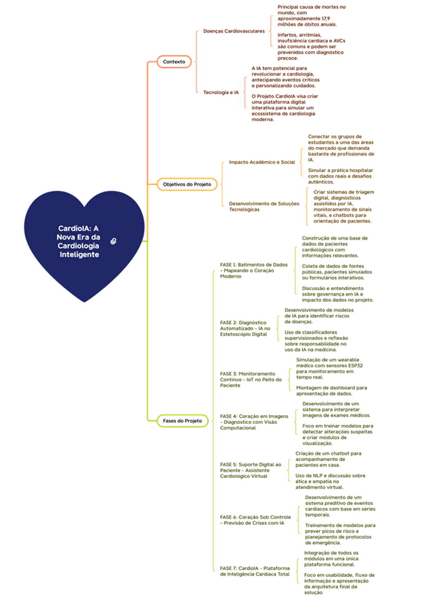
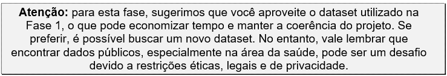

Atividade em grupo

Cap 1 - Desafio Integrador: IA entre Robôs, Sinapses e Medicina

de 03/09/2026 a 07/10/2026

Entrega pendente

Atividades entregues até 3 dias após o prazo receberão até 70% da nota.

O cálculo é feito automaticamente pelo sistema, o professor não tem controle sobre o percentual da nota atribuída.

Introdução
ATIVIDADE – FASE 2: Diagnóstico Automatizado – IA no Estetoscópio Digital

Atenção Atividade Avaliativa:         

- Verifique se o arquivo do upload está correto, não é possível enviar um outro arquivo após fechamento da entrega na plataforma ou correção do professor.         

- Não deixe para realizar a entrega da atividade nos últimos minutos do prazo, você pode ter algum problema e perder a entrega. As entregas são realizadas apenas pela plataforma.          

- Não disponibilize a resposta da sua atividade em grupos de WhatsApp, Discord, Microsoft Teams, pois pode gerar plágio e zerar a atividade para todos.         

- Você tem um período máximo de 15 dias após a publicação da nota para solicitar a revisão da correção.      

Enunciado de atividade:

Nesta fase, o projeto CardioIA irá desafiá-lo um pouco mais: você deverá simular a automatização do diagnóstico com IA — prática amplamente utilizada em centros de diagnóstico modernos, onde algoritmos se tornam os estetoscópios digitais do século XXI.

Como equipe, seu objetivo será desenvolver um módulo inteligente capaz de analisar dados clínicos e relatórios médicos, reconhecer sintomas e propor diagnósticos assistidos por IA. Você vai trabalhar com NLP, classificação de texto e análise de vieses a partir do dataset (visto na Fase 1), enfrentando os dilemas reais da Inteligência Artificial aplicada à saúde.

No mapa mental a seguir, você poderá ver em que ponto da sua jornada no PBL (Problem Project Learning) sua equipe se encontra. Observe o que está escrito na Fase 2, mas procure também compreender o contexto geral, preparando-se para as próximas fases.

Para visualizar o mapa mental completo, acesso o link: mapaMental - CardioIA_ A Nova Era da Cardiologia Inteligente.svg https://fiapcom.sharepoint.com/:u:/s/GestodeContedosOn/Ef4BY4hilsxCnmDoGVc-lF8BhZFskqsxjhdcRGV_ilJ96Q?e=Ev5HoJ

Objetivo geral dessa atividade:

Você irá aplicar os conteúdos de algumas disciplinas desta fase para desenvolver soluções práticas de diagnóstico automatizado. A ideia aqui é mostrar como um código “simples” aliado com dados bem-organizados, pode gerar soluções básicas que se aproximam do funcionamento de sistemas reais utilizados em hospitais e centros de tratamentos.

Isso inclui interpretar pequenos textos médicos, identificar sintomas e relacioná-los a doenças, utilizando estruturas simples. Também faz parte da tarefa, o treinamento de um modelo de IA capaz de prever o risco de um paciente com base em frases curtas. E o melhor: todo processo será feito por você e seu grupo, utilizando sua capacidade intelectual e criatividade.

Ao final dessa fase, você poderá ter construído algo que muitos profissionais que atuam hoje no mercado da área de saúde adorariam ter em mãos. Durante esse processo, você também será estimulado a refletir sobre a qualidade e a justiça dos dados, dando seus primeiros passos como um desenvolvedor de IA responsável, isto é, se preocupando com o tema “governança em dados”.

Atividade detalhada:

Parte 1 – Frases de sintomas + extração de informações:

Criar um arquivo .txt com 10 frases completas que simulem pequenas descrições de sintomas relatados por pacientes. As frases devem conter informações como o que o paciente sente, quando começou e como os sintomas afetam sua rotina (por exemplo: “Há dois dias estou com uma dor no peito que piora quando faço esforço físico”, “Sinto cansaço constante há uma semana, mesmo depois de descansar”).
Criar uma estrutura simples de associação entre sintomas e doenças usando uma planilha ou um arquivo *.csv. A ideia é montar um mapa de conhecimento que relacione palavras ou expressões comuns (sintomas relatados pelos pacientes) com possíveis diagnósticos. Por exemplo:
"dor no peito", "aperto no tórax" → Infarto.
"cansaço constante", "fadiga" → Insuficiência Cardíaca.
"falta de ar", "dificuldade para respirar" → Angina.
Use uma estrutura de colunas como:
Sintoma 1 | Sintoma 2 | Doença Associada.
Essa atividade pode ajudar a entender como sistemas inteligentes estruturam informações para auxiliar em diagnósticos médicos.
Quanto mais linhas o seu arquivo .csv tiver, melhor será o seu processo de decisão e classificação de doenças.
Utilize um código Python para ler as frases do arquivo .txt, identificar os sintomas com base nessas expressões e sugerir um possível diagnóstico com base no mapa de conhecimento. As 10 frases representam uma estrutura inicial e funcional para 10 diagnósticos simples de pacientes diversos, desde que as frases sejam exemplos variados e bem elaborados. Essa quantidade de frases é suficiente para testar a extração de sintomas com base no mapa de conhecimento e para simular o funcionamento de um sistema básico de apoio ao diagnóstico. Lembre-se de que quanto mais claras e diversificadas forem as frases, melhor será o desempenho da lógica de identificação e sugestão de diagnóstico.
 

Entregáveis:

Arquivo .txt com 10 frases completas simulando descrições de sintomas relatados por pacientes.
Planilha ou arquivo .csv com o mapa de conhecimento (associação entre sintomas e possíveis diagnósticos).
Código Python (.ipynb ou .py) que faz a leitura do arquivo de frases, identifica os sintomas e sugere diagnósticos com base na ontologia.
 

Parte 2 – Classificador básico de texto:

Aqui, você irá desenvolver um classificador básico de texto que analisa frases com sintomas e classifica o nível de risco como “baixo risco” ou “alto risco”. Essa tarefa simula o funcionamento de sistemas automatizados utilizados na triagem clínica, que ajudam a priorizar atendimentos com base na gravidade relatada.

Montar uma pequena base simulada no formato .csv, contendo frases médicas já rotuladas com o nível de risco. Exemplo: frase,situacao.
"sinto dor no peito e falta de ar",alto risco
"tive um leve incômodo nas costas",baixo risco
Aplicar o método TF-IDF para transformar essas frases em vetores numéricos que possam ser entendidos pelo algoritmo de Machine Learning.
Escolher um modelo de classificação simples (como Decision Tree, Logistic Regression ou outro do Scikit-learn) para treinar seu sistema e testá-lo com os dados.
Avaliar o desempenho do modelo com base na acurácia e em como ele se comporta diante de frases de risco diferente, observando eventuais padrões ou distorções que possam surgir nos resultados. Esta etapa do projeto marca um ponto-chave da sua jornada: você estará reproduzindo, com ferramentas acessíveis, a lógica por trás de sistemas reais utilizados em triagens clínicas.
 

Entregáveis:

Arquivo .csv com frases e rótulos.
Código .ipynb com TF-IDF, classificação e avaliação do modelo.
Repositório público no GitHub contendo todos os arquivos do projeto da Fase 2.
Um vídeo de até 4 minutos demonstrando o funcionamento completo da solução (pode ser com gravação de tela e explicação por voz ou legenda). O vídeo deve ser postado no YouTube como "não listado" e o link deve ser incluído no README do repositório no GitHub.
Critérios de Avaliação (10 pontos totais):

Critério

Pontos

Relatos e mapa de conhecimento organizados  = 2

Código de extração de informações funcional = 2

Dataset simples criado corretamente = 1

Classificador treinado e testado corretamente = 2

Documentação clara e repositório público no GitHub com README completo = 1

Vídeo de demonstração no YouTube (não listado) com link incluído no GitHub = 2

Ir Além 1 – Criando a interface do CardioIA:

Nesta atividade, você será responsável por construir apenas a interface do CardioIA. A proposta é criar um pequeno portal responsivo em React + Vite, que simule a visualização de dados de pacientes, agendamentos e um painel com métricas simples. Os dados utilizados devem ser simulados (via arquivos JSON locais ou API pública de exemplo), e nenhuma integração real com back-end será necessária. O foco é aplicar os conceitos aprendidos em Front-End, com destaque para Hooks avançados e Context API.

Você e seu grupo deverão criar uma aplicação em React com Vite que contenha:

Autenticação simulada via Context API (com JWT fake no localStorage);
Listagem de pacientes utilizando API fake (como JSONPlaceholder) ou base simulada;
Formulário de agendamento de consultas com uso de useState e useReducer;
Dashboard simples com contagem de pacientes e consultas agendadas;
Proteção de rotas com AuthContext (só mostrar dados se o usuário estiver logado);
Estilização com CSS Modules ou Styled Components.
Objetivo:

Construir uma aplicação front-end interativa que simule, de forma visual, a rotina de um portal de diagnóstico em cardiologia, utilizando React e seguindo boas práticas de componentização, navegação, autenticação simulada e manipulação de estado.

 

Entregáveis:

Repositório público no GitHub com o nome: nome-do-grupo-cardioia-portal.
Código-fonte completo com as pastas:
/contexts, /components, /services, /pages.
README.md com instruções de instalação e execução.
Lista com nome completo e RM dos integrantes.
Um vídeo de até 4 minutos demonstrando o funcionamento completo da solução (pode ser com gravação de tela e explicação por voz ou legenda). O vídeo deve ser postado no YouTube como "não listado" e o link deve ser incluído no README do repositório no GitHub.
 

Critérios de Avaliação:

Autenticação funcional e proteção de rotas.
Consumo de API e controle de estado.
Uso correto de Hooks (useState, useEffect, useContext).
Componentização e organização do projeto.
Estilização responsiva e usabilidade.
 

Ir Além 2 – Diagnóstico visual em cardiologia com rede neural:

Nesta atividade, você irá aplicar uma Rede Neural Artificial (MLP) para classificar imagens médicas relacionadas a diagnósticos cardiológicos. A proposta é utilizar uma base de dados pública com imagens de eletrocardiogramas (ECG) e treinar um modelo para identificar se o sinal indica um ritmo cardíaco normal ou alguma anomalia.

Essa atividade amplia os conceitos do CardioIA para o campo do diagnóstico visual, reforçando a importância da IA na triagem automatizada de pacientes e no apoio à decisão médica.

 

Objetivo:

Utilizar um dataset público de imagens de ECG com classificação binária (normal vs. anormal).
Pré-processar as imagens e convertê-las para um formato compatível com redes neurais simples (por exemplo: redimensionar e converter para tons de cinza).
Criar uma rede neural do tipo MLP (Perceptron Multicamadas) usando Keras.
Treinar e testar o modelo com base nos dados.
Avaliar a acurácia do classificador.
Recomendação de Dataset:

<https://www.kaggle.com/datasets/shayanfazeli/heartbeat>.

 

Entregáveis:

Notebook (.ipynb) com todo o código comentado e funcional.
Repositório público no GitHub contendo o notebook, exemplos de imagens e um README explicativo.
Um vídeo de até 4 minutos demonstrando o funcionamento do projeto, explicando o código, os dados e os resultados. O vídeo deve ser postado no YouTube como "não listado" e o link incluído no README do Git.
 

Critérios de Avaliação:

Pré-processamento correto das imagens.
Implementação funcional da rede MLP com Keras.
Treinamento e avaliação com resultados apresentados.
Organização e clareza do código no notebook.
 

Mensagem final:

Treinar e interpretar um modelo de IA para prever riscos é uma tarefa que, embora simples na superfície, exige olhar analítico e responsabilidade. Ao dominar essa etapa, você desenvolve habilidades cada vez mais valorizadas no mercado — habilidades que poucos dominam com uma visão crítica e aplicada. Siga em frente nesta jornada com autonomia e criatividade. É assim que grandes cientistas surgem.

 