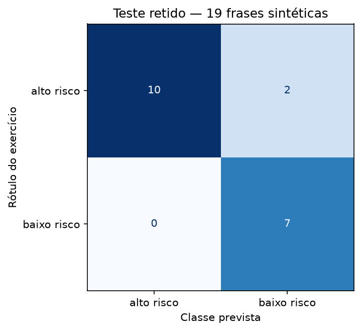

# Resultados da Parte 2

Execução em 22/09/2026 com Python 3.12.10, pandas 3.0.5, NumPy 2.5.3 e scikit-learn 1.9.1. Notebook executado em kernel novo, com saídas salvas. Dados e parâmetros foram fixados antes de avaliar; não houve busca de sementes ou ajuste pelos erros.

## Avaliação

41 frases de treino e 19 de teste, com grupos/famílias sem sobreposição. Teste: 12 altos e sete baixos. O baseline prevê sempre baixo risco, a classe mais frequente do treino.

| Medida | Resultado |
|---|---|
| Acurácia do modelo | 17/19 = 89,47% |
| Acurácia do baseline | 7/19 = 36,84% |
| Precisão de alto risco | 100,00% |
| Recall de alto risco | 83,33% (10/12) |
| F1 de alto risco | 90,91% |
| Precisão de baixo risco | 77,78% |
| Recall de baixo risco | 100,00% (7/7) |
| F1 de baixo risco | 87,50% |

## Erros observados

| ID | Frase | Rótulo | Previsão |
|---|---|---|---|
| P23 | Não estou suando, mas sinto um aperto no peito junto com falta de ar desde que acordei. | alto risco | baixo risco |
| P32 | Acordei durante a noite com o coração batendo fora do ritmo e estou ofegante mesmo depois de me sentar. | alto risco | baixo risco |

Foram dois falsos negativos, considerando alto risco como classe positiva, e nenhum falso positivo. P23 contém negação parcial; P32 usa formas linguísticas diferentes das frases de treino. Essas são hipóteses de dificuldade, não causas comprovadas dos erros. O notebook mostra termos fora do vocabulário e contribuições do modelo para inspecionar essas hipóteses.

P05/P10 foram corretamente diferenciadas, e P14 foi classificada como alta apesar da palavra leve. Isso demonstra comportamentos pontuais; não prova compreensão de negações ou gravidade. As sondas reutilizam a base, incluem exemplos de treino identificados e não entram novamente na acurácia.

## Limites da interpretação

O teste é uma divisão por cenários retidos, definida antes do treino, e contém apenas dois grupos. Não é uma amostra clínica independente: a classe baixa do teste representa bem-estar, enquanto o treino traz sobretudo queixas localizadas em melhora. Há dependência linguística residual entre grupos e elaboração sintética majoritariamente pela mesma IA. Acurácia elevada não significa segurança de triagem. Não se mediu justiça demográfica, não houve validação externa nem calibração.

Detalhes em [PROTOCOLO_AVALIACAO.md](PROTOCOLO_AVALIACAO.md). Artefatos auditáveis: [métricas](resultados/metricas.json), [previsões por ID](resultados/previsoes_teste.csv), [sondas](resultados/sondas.csv) e [notebook executado](classificador_risco.ipynb). Se os erros orientarem ajustes futuros, será necessário outro conjunto independente para avaliação final.
